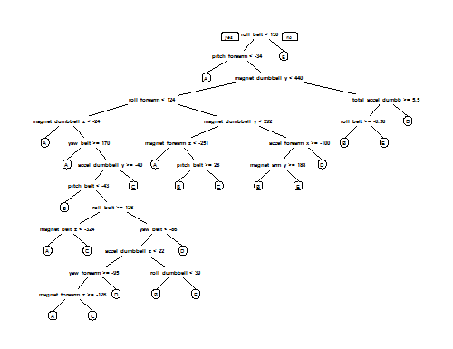

## Course Project -- Exercise manner prediction

### Background
Using devices such as Jawbone Up, Nike FuelBand, and Fitbit it is now possible to collect a large amount of data about personal activity relatively inexpensively. These type of devices are part of the quantified self movement – a group of enthusiasts who take measurements about themselves regularly to improve their health, to find patterns in their behavior, or because they are tech geeks. One thing that people regularly do is quantify how much of a particular activity they do, but they rarely quantify how well they do it.
### Structure
- Two tables in the data folder are training dataset and testing dataset respectively.
- The file "exercise manner.Rmd" contains the whole R codes and results.

### Data
The raw data for this project come from this source: http://groupware.les.inf.puc-rio.br/har.

### Goal
In this project,my goal will be to use data from accelerometers on the belt, forearm, arm, and dumbell of 6 participants. They were asked to perform barbell lifts correctly and incorrectly in 5 different ways. More information is available from the website here: http://groupware.les.inf.puc-rio.br/har (see the section on the Weight Lifting Exercise Dataset).

### View HTML
Link to the page: click [here](https://sherrywangye.github.io/)

## Library loading

```{r}
library(caret)
library(rpart)
library(rpart.plot)
library(randomForest)
library(corrplot)
library(psych)
```

## Data processing
### Download data
Firsly,we download the raw data from website.
```{r}
trainUrl <-"https://d396qusza40orc.cloudfront.net/predmachlearn/pml-training.csv"
testUrl <- "https://d396qusza40orc.cloudfront.net/predmachlearn/pml-testing.csv"
trainFile <- "pml-training.csv"
testFile  <- "pml-testing.csv"
```

### Read the data
After downloading the data ,we can read the two csv files into two data frames.
```{r}
trainRaw<-read.csv("./data/pml-training.csv")
testRaw<-read.csv("./data/pml-testing.csv")
dim(trainRaw)
dim(testRaw)
```
### Clean the data
cleaning the data by removing the colnumns with NA to get prepared for later processing.
```{r}
sum(is.na(trainRaw))
sum(is.na(testRaw))
trainRaw <- trainRaw[,colSums(is.na(trainRaw)) == 0]
testRaw <- testRaw[, colSums(is.na(testRaw)) == 0]
```
Next,remove some columns that do not contribute to the accelerometer measurements.
```{r}
classe <- trainRaw$classe
trainRemove <- grepl("^X|timestamp|window", names(trainRaw))
trainRaw <- trainRaw[, !trainRemove]
trainRaw <- trainRaw[, sapply(trainRaw, is.numeric)]
trainRaw$classe <- classe
testRemove <- grepl("^X|timestamp|window", names(testRaw))
testRaw <- testRaw[, !testRemove]
testRaw <- testRaw[, sapply(testRaw, is.numeric)]
```
Then plot scree plot producted from PCA and correlationship between all the variance.From the scree plot,we can see the main effect of principal component is not that obvious ,in other words,there is no obvious data redundancy in this case,which can also be proved by the correlation plot as well.
```{r}
corrPlot <- cor(subset(trainRaw,select=-c(classe)))
corrplot(corrPlot, method="color")
library(psych)
fa.parallel(subset(trainRaw,select=-c(classe)),fa="pc",n.iter=100,show.legend=FALSE,main="Scree plot with parallel analysis")
```


### Slice the data
The training set is relatively large ,so we slice the training data into two parts :training set and validation set.The testing set remains the same.
```{r}
set.seed(950419)
inTrain<-createDataPartition(y=trainRaw$class,p=0.7,list=F)
training<-trainRaw[inTrain,]
validation<-trainRaw[-inTrain,]
testing<-testRaw
```

## Data model
### Train our data
Due to the issue we are faced with,the prediction variance is a discrete one and non-numeric one,we choose **random forest** as the algorithm we apply in this progress.Besides,we use 3-fold cross validation in this algorithm.
```{r}
modelFit=train(classe~.,method="rf",data=training,trControl=trainControl(method="cv",3),number=250)
```
### Predict in  validation set
```{r}
pred<-predict(modelFit,newdata=validation)
confusionMatrix(validation$classe,pred)
accuracy <- postResample(pred, validation$classe)
accuracy
error <- 1 - as.numeric(confusionMatrix(validation$classe, pred)$overall[1])
error
```
Therefore, the estimated accuracy of the model is 99.42% and the estimated out of sample error is 0.58%.

### Visualization
we plot the tree plot to get an intuition of the tree.
```{r}
treeModel <- rpart(classe ~ ., data=training, method="class")
prp(treeModel)
```


### Predict in testing set(remove problem.id)
Finally,we predict the testing value.
```{r}
result <- predict(modelFit,subset(testing,select=-c(problem_id)))
result
```
Finally,we predict the testing value in 20 people in order as following:
```{r}
 [1] B A B A A E D B A A B C B A E E A B B B
Levels: A B C D E
```
